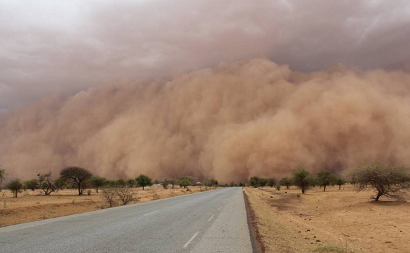

# #DataStory Sahel Initiative 2017

### C'est quoi ?
Une Exploration #DataDriven du Sahel

### C'est qui ? 
Corporate Hackers @AFD Group (CHAG)

### C'est quand ? 
20 Fev - 24 Mars // **C'est court !**

### C'est comment ? 
** C'est collaboratif **
- 3 demi journée mode #Makestorming
- Homework

### Source de données explorées ?
**Generaliste**
data.afd.fr : http://data.afd.fr
Humanitarian Data Exchange:https://data.humdata.org/ 
map: http://www.openstreetmap.org/

**Population:** http://www.worldpop.org.uk
**Violence:** http://www.acleddata.com/
**Occupation des sols:** https://modis.gsfc.nasa.gov/data/dataprod/mod12.php
**Perception:** http://www.afrobarometer.org/fr/pays/

**Open data nationaux - via ADB**
Mauritanie: http://mauritania.opendataforafrica.org/data#menu=topic
Mali: http://mali.opendataforafrica.org/ 
Niger http://niger.opendataforafrica.org/ 
Burkina: http://burkinafaso.opendataforafrica.org/
Tchad: http://chad.opendataforafrica.org/ 

###Dimensions
Démographiques (bassin de population, croissance démographique…) ;
Demographie  : population par aire, rural/urbain, localisation, densité, répartition
Economiques (taux de pauvreté, emploi…)
Taux
Sociaux (achèvement du primaire, scolarisation des filles, mortalité maternelle et infantile, accouchement assisté, malnutrition…)
Sécurité (conflits, attaques…)
Migratoires (zones d’émigration…)
Financement (fiscalité locale, financement autres bailleurs…).

